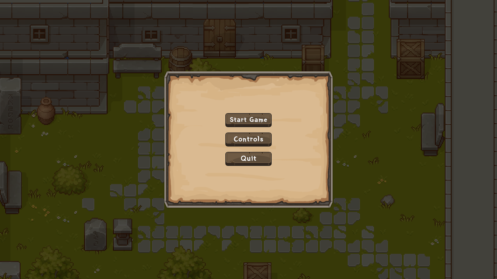
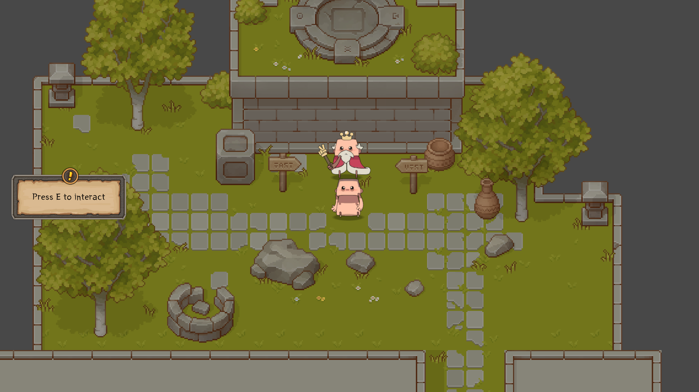
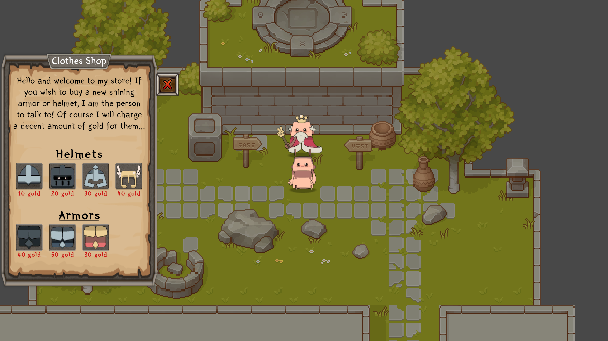
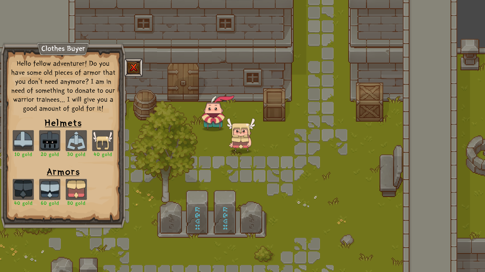
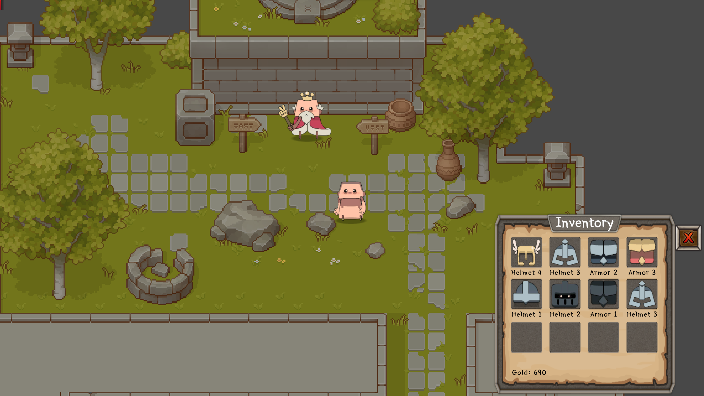
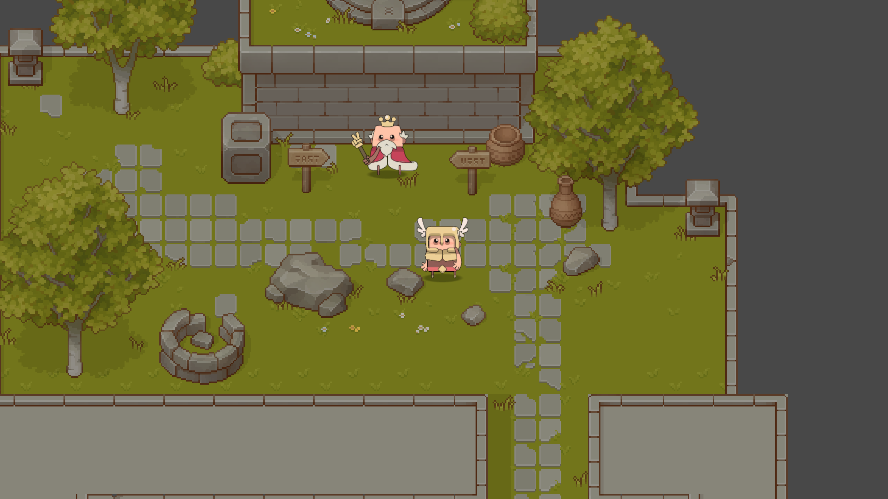
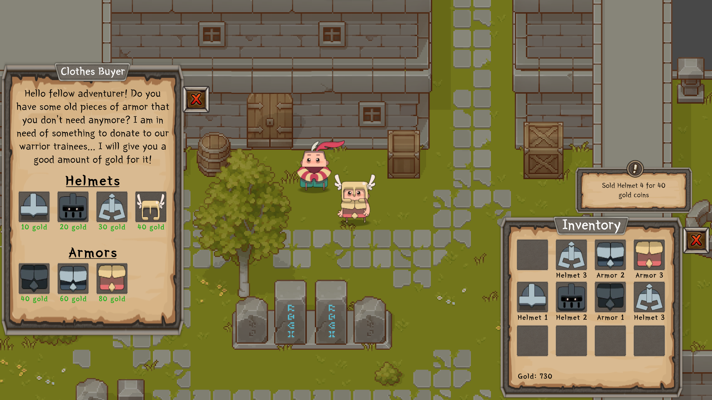

# 2D Clothes Shop

### Built With

[![Unity][Unity.com]][Unity-url] Version [2021.3.2f1](https://unity.com/releases/editor/archive#download-archive-2021)

[Unity.com]: https://img.shields.io/badge/Unity-FFFFFF?style=for-the-badge&logo=unity&logoColor=black
[Unity-url]: https://unity.com/

### Features

1. Loading Screen
2. Main Menu
3. Pause Menu
4. NPC Interaction
5. Clothes Shop (buy and sell items)
6. Inventory
7. Item equipping (changes player visual)
8. Responsive UI

### Game Preview

